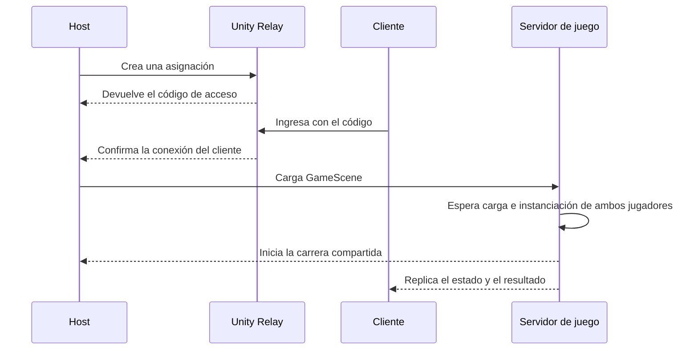

  

<h1 align="center">Urban Freerunner</h1>

  Carrera de parkour multijugador para dos personas, desarrollada con Unity, C#, Netcode for GameObjects y Relay.

  
  
  
  
  

  <a href="https://drive.google.com/file/d/1HQryq3KlAKxBWZM-q3UTxLFiFKtaSVCI/view?usp=sharing"><strong>Descargar la build jugable</strong></a>
  ·
  <a href="docs/BUILD.md">Guía de instalación</a>
  ·
  <a href="docs/ARCHITECTURE.md">Arquitectura</a>
  ·
  <a href="docs/TESTING.md">Pruebas y CI</a>
  ·
  <a href="https://docs.google.com/spreadsheets/d/1HyE2hVOfY0tSBOdW02WvCWOdlR_yjt9laemHNITDczw/edit?usp=sharing"><strong>Suite de QA y resultados</strong></a>

## Sobre el juego

Urban Freerunner es un prototipo académico multijugador desarrollado durante cuatro sprints por un equipo de cinco integrantes. Dos jugadores ingresan a una misma sesión en línea y compiten en un circuito urbano de obstáculos mediante movimiento, salto, carrera, wall running y un gancho.

El host crea una sesión de Relay y comparte un código de acceso. Cuando ambos jugadores terminaron de cargar y fueron instanciados, el servidor inicia una carrera compartida de 180 segundos. La primera llegada válida gana; si el tiempo termina, ambos jugadores pierden. Las caídas devuelven al jugador al último checkpoint sin detener el reloj.

## Características principales

- Flujo host/cliente en línea mediante Unity Relay, Unity Transport y autenticación anónima.
- Lobby por código con cantidad de jugadores, estado de conexión y controles exclusivos del host.
- Instanciación de jugadores después de sincronizar la carga de la escena.
- Activación de entrada, cámara, audio e interfaz únicamente para el jugador propietario.
- Inicio, temporizador, validación del resultado y estado de victoria o derrota controlados por el servidor.
- Movimiento de parkour, wall running, gancho, checkpoints, respawn y mejoras temporales de velocidad.
- Suites automatizadas de EditMode y PlayMode ejecutadas mediante GitHub Actions y GameCI.
- Proceso de QA documentado con trazabilidad, ejecución manual y evidencias por sprint.

## Tecnologías

| Área | Herramientas |
| --- | --- |
| Motor | Unity `6000.3.22f1`, Universal Render Pipeline |
| Lenguaje | C# |
| Multijugador | Netcode for GameObjects, Unity Transport, Unity Relay |
| Entrada e interfaz | Unity Input System, uGUI, TextMesh Pro |
| Calidad | Unity Test Framework, NUnit, pruebas manuales, GameCI |
| Colaboración | Git, GitHub, pull requests y desarrollo por sprints |

## Flujo multijugador

La [documentación de arquitectura](docs/ARCHITECTURE.md) incluye el mapa de componentes y el modelo de autoridad.

## Reglas de la partida

- **Jugadores:** exactamente dos en el flujo multijugador validado.
- **Objetivo:** llegar a la meta antes que el rival.
- **Límite de tiempo:** 180 segundos.
- **Llegada:** gana el primer evento válido procesado por el servidor.
- **Fin del tiempo:** ambos jugadores pierden si no se registró una llegada válida.
- **Recuperación:** una caída devuelve al jugador al último checkpoint y el temporizador continúa.

### Controles

| Acción | Entrada |
| --- | --- |
| Movimiento | `W`, `A`, `S`, `D` |
| Correr | `Shift izquierdo` |
| Saltar | `Espacio` |
| Mirar | Mouse |
| Gancho | Botón derecho del mouse |

## Build jugable

La build publicada está preparada para **Windows de 64 bits** y se distribuye como un archivo RAR de 124,2 MiB.

1. [Descargar `Build.rar`](https://drive.google.com/file/d/1HQryq3KlAKxBWZM-q3UTxLFiFKtaSVCI/view?usp=sharing).
2. Extraer el archivo completo.
3. Ejecutar `Build/TpProyectoUnity.exe`.
4. Para jugar en red, iniciar como host, compartir el código y conectarse desde una segunda instancia o computadora.

## Pruebas y evidencias

El proyecto combina Unity Test Framework con pruebas manuales multijugador, trazabilidad de criterios de aceptación y evidencias registradas durante los Sprints 2, 3 y 4.

| Sprint | Casos documentados | Aprobados | Fallidos | Bloqueados | Pendientes |
| --- | ---: | ---: | ---: | ---: | ---: |
| Sprint 2 | 18 | 14 | 3 | 0 | 1 |
| Sprint 3 | 30 | 27 | 1 | 2 | 0 |
| Sprint 4 | 27 | 27 | 0 | 0 | 0 |
| **Total** | **75** | **68** | **4** | **2** | **1** |

La [suite consolidada de QA y resultados](https://docs.google.com/spreadsheets/d/1HyE2hVOfY0tSBOdW02WvCWOdlR_yjt9laemHNITDczw/edit?usp=sharing) reúne los 75 casos, 75 registros de ejecución, 38 criterios de aceptación y 44 enlaces directos a evidencias. También conserva en una pestaña separada los cruces de IDs y fechas que requieren revisión, sin completar información que no está respaldada por los archivos originales.

  

<em>Captura real de QA: ambas instancias reciben el resultado resuelto por el servidor.</em>

La [documentación de pruebas y CI](docs/TESTING.md) explica la cobertura automatizada, el flujo local y la validación multijugador.

## Equipo

| Integrante | Enfoque principal |
| --- | --- |
| Felipe Dellutri | Desarrollo de gameplay |
| Juan Ignacio Gallardo | Diseño de juego y niveles |
| Bruno Masdeu | Scrum Master, gestión y documentación |
| Tomás Molina Varas | Integración multijugador, pruebas automatizadas y CI |
| Sebastián Souza | Desarrollo de gameplay |

## Estado del proyecto

El proyecto es un prototipo académico finalizado, no un lanzamiento comercial. El alcance validado corresponde a una experiencia para dos jugadores en Windows mediante Relay. Matchmaking, persistencia, progresión, anti-cheat e infraestructura backend a escala de producción quedan fuera del alcance.
