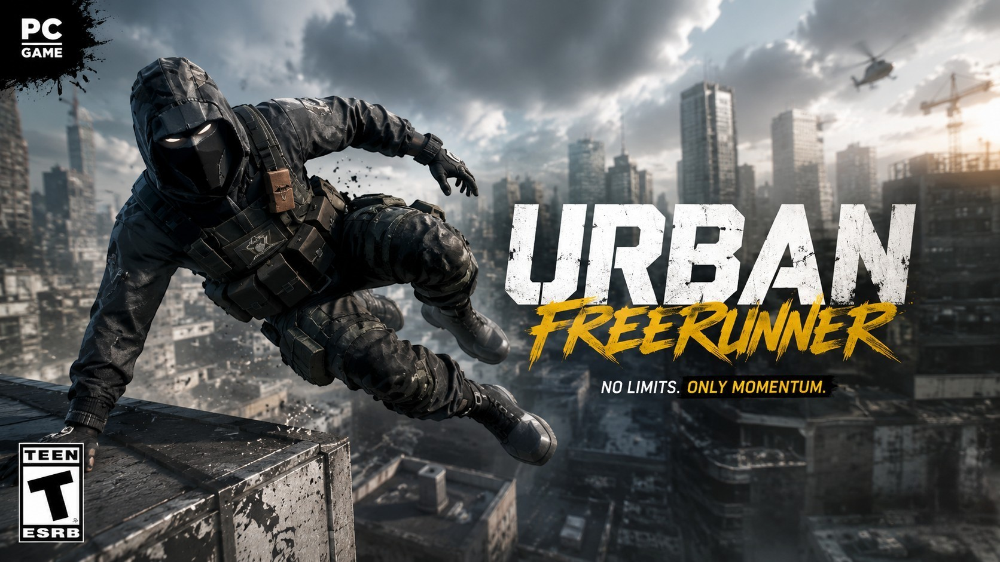
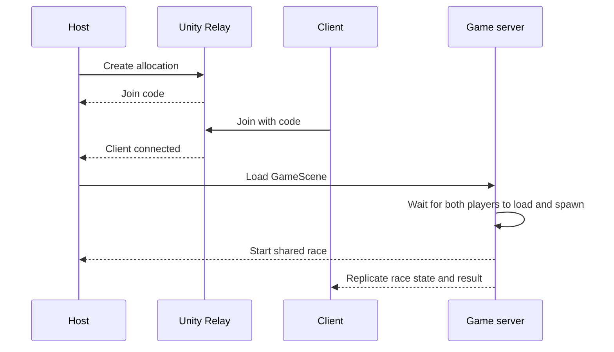

  

<h1 align="center">Urban Freerunner</h1>

  A two-player online parkour race built with Unity, C#, Netcode for GameObjects and Relay.

  
  
  
  
  

  <a href="https://drive.google.com/file/d/1HQryq3KlAKxBWZM-q3UTxLFiFKtaSVCI/view?usp=sharing"><strong>Download the playable build</strong></a>
  ·
  <a href="docs/BUILD.md">Build guide</a>
  ·
  <a href="docs/ARCHITECTURE.md">Architecture</a>
  ·
  <a href="docs/TESTING.md">Testing and CI</a>

## About the game

Urban Freerunner is an academic multiplayer prototype developed over four sprints by a five-person team. Two players join the same online session and race through an urban obstacle course using movement, jumping, sprinting, wall running and a grappling hook.

The host creates a Relay session and shares a short join code. Once both players have loaded and spawned, the server starts a shared 180-second race. The first valid finish wins; if time expires, both players lose. Falls return the player to the latest checkpoint without stopping the clock.

## Highlights

- Online host/client flow using Unity Relay, Unity Transport and anonymous authentication.
- Join-code lobby with player count, connection status and host-only start controls.
- Deferred network spawning after synchronized scene loading.
- Owner-specific input, camera, audio and UI activation.
- Server-controlled race start, timer, result validation and shared win/loss state.
- Parkour movement, wall running, grappling, checkpoints, respawn and speed boosts.
- Automated EditMode and PlayMode suites executed through GitHub Actions and GameCI.

## Technology

| Area | Tools |
| --- | --- |
| Engine | Unity `6000.3.22f1`, Universal Render Pipeline |
| Language | C# |
| Multiplayer | Netcode for GameObjects, Unity Transport, Unity Relay |
| Input and UI | Unity Input System, uGUI, TextMesh Pro |
| Quality | Unity Test Framework, NUnit, GameCI |
| Collaboration | Git, GitHub, pull requests and sprint-based development |

## Multiplayer flow

See [Architecture](docs/ARCHITECTURE.md) for the component map and authority model.

## Gameplay rules

- **Players:** exactly two in the tested multiplayer flow.
- **Objective:** reach the finish line before the other player.
- **Time limit:** 180 seconds.
- **Finish:** the first valid finish event processed by the server wins.
- **Timeout:** both players lose if no valid finish is registered.
- **Recovery:** falling respawns the player at the latest checkpoint while the timer continues.

### Controls

| Action | Input |
| --- | --- |
| Move | `W`, `A`, `S`, `D` |
| Sprint | `Left Shift` |
| Jump | `Space` |
| Look | Mouse |
| Grappling hook | Right mouse button |

## Build

The current playable artifact targets **Windows 64-bit** and is distributed as a 124.2 MiB RAR archive.

1. [Download `Build.rar`](https://drive.google.com/file/d/1HQryq3KlAKxBWZM-q3UTxLFiFKtaSVCI/view?usp=sharing).
2. Extract the complete archive.
3. Run `Build/TpProyectoUnity.exe`.
4. For multiplayer, start a host, share the join code and connect from a second instance or computer.

## Testing and evidence

The repository contains focused EditMode and PlayMode coverage for race rules, player readiness, movement, respawn, wall collisions, speed boosts and integrated gameplay configuration. The CI workflow runs both test modes independently and preserves their results as build artifacts.

  

<em>Actual QA capture: two instances receive the same server-resolved race outcome.</em>

See [Testing and CI](docs/TESTING.md) for the suite structure and validation scope.

## Team

| Member | Main focus |
| --- | --- |
| Felipe Dellutri | Gameplay development |
| Juan Ignacio Gallardo | Game and level design |
| Bruno Masdeu | Scrum Master, management and documentation |
| Tomás Molina Varas | Multiplayer integration, automated testing and CI |
| Sebastián Souza | Gameplay development |

## Project status

This is a completed academic prototype, not a commercial release. The validated scope is a two-player Windows experience using Relay. Matchmaking, persistence, progression, anti-cheat and production-scale backend infrastructure are outside the project scope.
