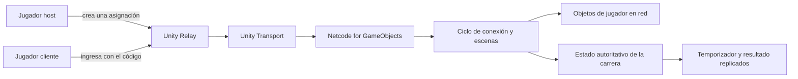
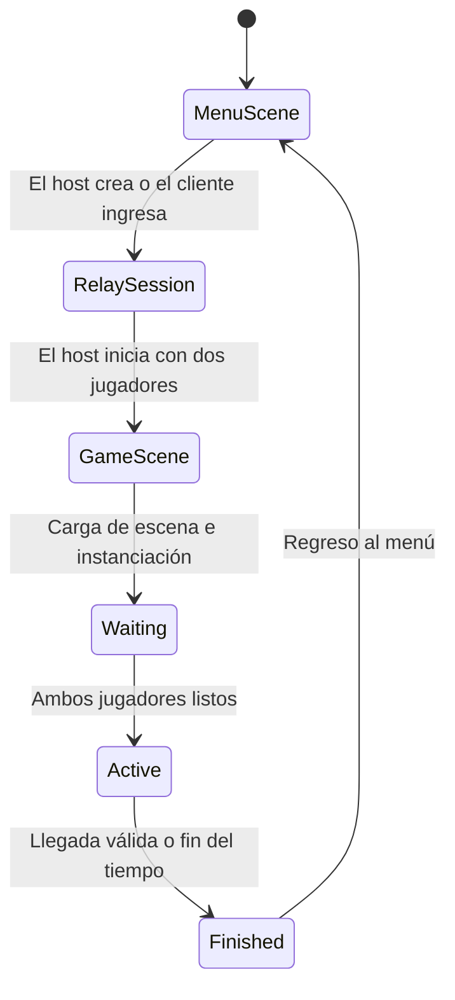

# Urban Freerunner — Arquitectura

## Vista general

Urban Freerunner utiliza una topología host/cliente construida con Netcode for GameObjects, Unity Transport y Unity Relay. Relay permite establecer la conexión mediante un código; no funciona como sistema de matchmaking ni como lobby persistente.

## Componentes principales

| Componente | Responsabilidad |
| --- | --- |
| [`ConnectionManager`](../Assets/Scripts/ConnectionManager.cs) | Inicializa Unity Services, autentica de forma anónima, crea o utiliza asignaciones de Relay y controla la interfaz del lobby. |
| [`LobbyPlayerSpawner`](../Assets/Scripts/Network/LobbyPlayerSpawner.cs) | Aprueba conexiones, espera la carga sincronizada de la escena, instancia un jugador por cliente e inicia la carrera cuando ambos están listos. |
| [`PlayerNetworkSetup`](../Assets/Scripts/Network/PlayerNetworkSetup.cs) | Habilita entrada, cámara, audio e interfaz únicamente para el propietario y coordina el respawn seguro en red. |
| [`GameManager`](../Assets/Scripts/GameManager.cs) | Controla el ciclo compartido de la carrera, el temporizador, la validación de llegada y el resultado final. |
| [`RaceStatusUI`](../Assets/Scripts/RaceStatusUI.cs) | Muestra a cada cliente el estado y el resultado replicados. |
| [`SpeedBoostController`](../Assets/Scripts/Network/SpeedBoostController.cs) | Aplica un multiplicador temporal de velocidad mediante el tiempo del servidor y variables de red replicadas. |

## Flujo de escenas

`MenuScene` contiene la sesión de red y el lobby. `GameScene` contiene el circuito, el punto de aparición, los sistemas de carrera y los jugadores en red.

## Modelo de autoridad

- El host/servidor controla la aprobación de conexiones, la carga sincronizada de escenas y el ciclo de la carrera.
- Cada cliente habilita entrada, cámara, audio y HUD solamente para su propio `NetworkObject`.
- El servidor acepta el inicio, el fin del tiempo y el resultado final, y los replica a ambos jugadores.
- El movimiento se mantiene responsivo para el propietario y se sincroniza mediante los componentes de Netcode.
- Las solicitudes de respawn pasan por la configuración de red antes de trasladar al jugador a un checkpoint seguro.

Esta separación evita que un jugador remoto controle las entradas locales de otro y mantiene un resultado consistente entre clientes.

## Alcance y decisiones de diseño

- El tamaño de sesión validado es de dos jugadores.
- Relay aporta conectividad; el proyecto no implementa lobbies buscables ni matchmaking.
- La autenticación es anónima y no se almacenan cuentas, progresión ni historial persistente de partidas.
- El proyecto prioriza un ciclo de gameplay académico completo frente a la escalabilidad de backend o la protección anti-cheat de producción.
