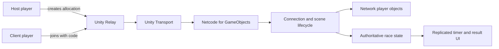
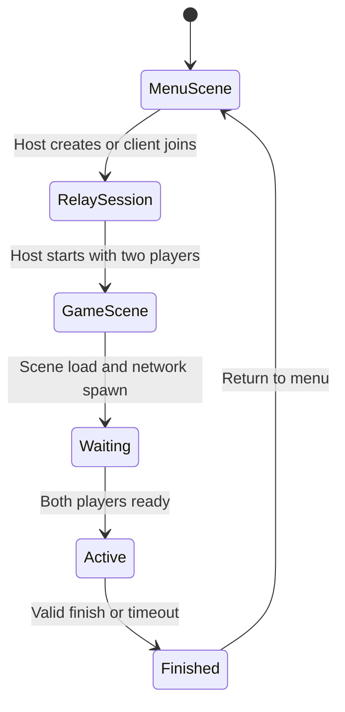

# Urban Freerunner — Architecture

## System overview

Urban Freerunner uses a host/client topology built with Netcode for GameObjects, Unity Transport and Unity Relay. Relay provides connectivity through a join code; it is not used as matchmaking or as a persistent lobby service.

## Core components

| Component | Responsibility |
| --- | --- |
| [`ConnectionManager`](../Assets/Scripts/ConnectionManager.cs) | Initializes Unity Services, authenticates anonymously, creates or joins Relay allocations and controls the lobby UI. |
| [`LobbyPlayerSpawner`](../Assets/Scripts/Network/LobbyPlayerSpawner.cs) | Approves connections, waits for the synchronized game-scene load, spawns one player per client and starts the race when both players are ready. |
| [`PlayerNetworkSetup`](../Assets/Scripts/Network/PlayerNetworkSetup.cs) | Enables input, camera, audio and UI only for the owning player; coordinates network-safe respawn behavior. |
| [`GameManager`](../Assets/Scripts/GameManager.cs) | Owns the shared race lifecycle, timer, finish validation and final result. |
| [`RaceStatusUI`](../Assets/Scripts/RaceStatusUI.cs) | Displays the replicated race status and outcome to each client. |
| [`SpeedBoostController`](../Assets/Scripts/Network/SpeedBoostController.cs) | Applies a timed speed multiplier using server time and replicated network variables. |

## Scene flow

`MenuScene` contains the network session and lobby flow. `GameScene` contains the course, spawn point, race systems and networked players.

## Authority model

- The host/server owns connection approval, synchronized scene loading and the race lifecycle.
- Each player only enables local input, camera, audio and HUD for its own `NetworkObject`.
- Race start, timeout and final result are accepted by the server and replicated to both players.
- Player movement remains responsive for the owning client and is synchronized through Netcode components.
- Respawn requests are validated through the network setup before teleporting the owning player to a safe checkpoint.

This separation prevents a remote player from driving another player's local controls and keeps the match outcome consistent across clients.

## Scope and trade-offs

- The validated session size is two players.
- Relay provides connectivity; the project does not implement searchable lobbies or matchmaking.
- Authentication is anonymous and no account, progression or persistent match history is stored.
- The project prioritizes a complete academic gameplay loop over production backend scalability or anti-cheat protection.
