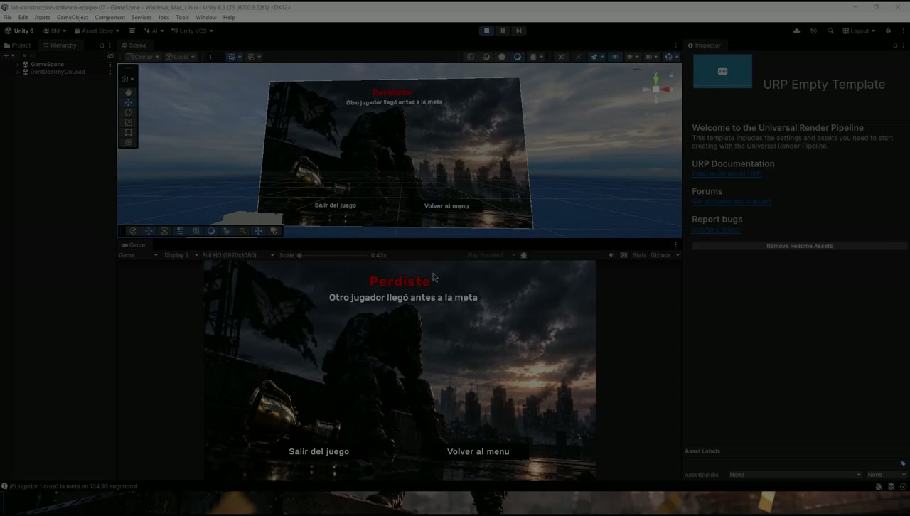

# Urban Freerunner — Testing and CI

## Strategy

The project combines automated Unity Test Framework suites with manual multiplayer evidence gathered during each sprint.

```text
Assets/Tests/
├── EditModeTests/
│   ├── RaceResultRulesTests.cs
│   ├── RaceStartRulesTests.cs
│   ├── Sprint3ConfigurationTests.cs
│   └── Sprint4RaceAutomatedTests.cs
└── PlayModeTests/
    ├── PlayerPlayModeTests.cs
    ├── SpeedBoostTests.cs
    ├── Sprint3GameplayTests.cs
    ├── Sprint4GameplayAutomatedTests.cs
    └── WallCollisionResponseTests.cs
```

Example and infrastructure-validation tests remain in the repository as part of the project's testing evolution. For that reason, the portfolio describes the covered behaviors instead of presenting every annotated test method as an independent product requirement.

## Automated coverage

| Area | Examples |
| --- | --- |
| Race readiness | Required player count, scene-load completion, spawned-player readiness and timeout rejection |
| Race result rules | Valid finish events, duplicate or late events, winner/loser resolution and timeout behavior |
| Player lifecycle | Ownership setup, fall detection, checkpoint respawn and velocity reset |
| Movement | Running, jumping, collision response and wall behavior |
| Power-ups | Server-side validation, shared server time and speed reset |
| Configuration | Required scenes, prefabs, components and sprint acceptance conditions |

## Continuous integration

The workflow at [`.github/workflows/unity-tests.yml`](../.github/workflows/unity-tests.yml) uses GameCI's Unity Test Runner.

- Runs on pushes to `develop`.
- Runs on pull requests targeting `develop`.
- Executes EditMode and PlayMode as separate matrix jobs.
- Uses Git LFS during checkout.
- Uploads test results as GitHub Actions artifacts even when a job fails.

[View the Unity test workflow](https://github.com/molinavtomas/lab-construccion-software-equipo-07/actions/workflows/unity-tests.yml)

## Run locally

1. Open the project with Unity `6000.3.22f1`.
2. Open **Window → General → Test Runner**.
3. Run the EditMode suite.
4. Run the PlayMode suite.
5. Review failures together with the Unity Console and the relevant scene or prefab configuration.

## Multiplayer evidence

Automated tests cover deterministic rules and component behavior. The full host/client flow was also exercised with two running instances to validate Relay connection, player ownership, synchronized scene loading, race completion and shared results.



The image is a frame from the Sprint 4 QA evidence and shows both instances after the server resolved the race outcome.
